# rmux

A minimal terminal multiplexer built on [`libghostty-vt`](https://crates.io/crates/libghostty-vt),
the terminal emulation library extracted from [Ghostty](https://ghostty.org).

It follows the tmux client/server model: a long-lived **server** owns all
sessions → tabs → panes, spawning shells on ptys and feeding their output
through libghostty's VT parser; thin **clients** attach to a session by
name over a Unix socket and just pump bytes — rendered frames down to
your terminal, raw keystrokes up to the server. Sessions survive SSH
disconnects; reattach and everything is as you left it. At most one
client per session: a new attach kicks the old client.

```sh
rmux server          # run the server (or use systemd, below)
rmux a work          # attach to session "work", creating it if new
rmux list            # sessions: tabs, panes, attach state (colored on tty)
```

Detach with **Ctrl+g** (or just close the terminal / drop the SSH
connection — the session keeps running).



## Running under systemd

`rmux.service` is a **system** service: it starts at boot and runs
independently of login sessions, so the server (and your shells)
survive SSH logouts with no `loginctl enable-linger` dance. First edit
the `User=` and `ExecStart=` lines in `rmux.service` to match your
username and binary path, then:

```sh
cargo build --release
sudo cp rmux.service /etc/systemd/system/
sudo systemctl daemon-reload
sudo systemctl enable --now rmux
```

The unit's `User=` keeps the server — and every shell it spawns —
running as your user, not root. Server logs land in the system journal:
`journalctl -u rmux`.

The socket lives at `/tmp/rmux-<uid>.sock` (override with the
`RMUX_SOCK` env var, e.g. for tests). It is deliberately not under
`$XDG_RUNTIME_DIR`, which is torn down on logout and absent for system
services.

## Requirements

- Rust 1.90+
- [Zig](https://ziglang.org) and `git` on PATH — `libghostty-vt-sys` builds
  libghostty-vt from Ghostty source at build time (`pacman -S zig` on Arch,
  or a local install in `~/.local/bin` works fine)

## Run (without systemd)

```sh
cargo run --release -- server    # in one terminal, or backgrounded
cargo run --release -- a main    # attach from anywhere
```

A session disappears when all its shells exit; the server keeps running
and accepting new attaches until stopped.

## Sessions, tabs, panes

Terminals are organized as **sessions → tabs → panes**: a session is a
named group of tabs, a tab holds one or more panes in a split tree, and
each pane is one shell.

The bottom row is a tab bar: the session name as a colored chip,
followed by the session's tabs with the open tab in the accent color and
the rest dimmed. The managers and name prompt render as centered
rounded-corner panels with a `❯` selector and an `●` dot marking the
open entry; pane dividers join with proper tees/crosses (`├ ┬ ┼`), and
the dividers framing the focused pane are drawn in the accent color. The
accent color defaults to the terminal palette's cyan (follows your
theme) and can be set to any hex color in the config:

```yaml
accent: "#7aa2f7"
```

### Splits

- **Ctrl+k** — split the focused pane horizontally (stacked top/bottom)
- **Ctrl+l** — split the focused pane vertically (side by side)
- **Ctrl+q / Ctrl+w / Ctrl+e / Ctrl+r** — move focus left / right / up
  / down (nearest pane in that direction)

Left/right navigation crosses tabs: moving right from a tab's rightmost
pane switches to the next tab and lands on its leftmost pane (and vice
versa going left), wrapping around at the ends — the session's tabs form
one horizontal strip. Up/down stay within the tab.
- **Ctrl+t** — cycle focus to the next pane
- **Ctrl+f** — fullscreen the focused pane (everything except the tab
  bar); press again to restore the layout. Splitting or moving focus
  also restores it, and the pane's shell is really resized both ways

The new pane gets the bottom/right half and receives focus. Splits are
always 50/50; a pane too small to split ignores the request. When a
pane's shell exits, its sibling takes over the space.

Note these bytes are swallowed by the wrapper, so their usual shell
meanings are unavailable inside it: ctrl+k (readline kill-line), ctrl+l
(clear screen — type `clear` instead), ctrl+t (transpose-chars), ctrl+q
(XON), ctrl+w (kill-word), ctrl+e (end-of-line), ctrl+r
(reverse-i-search — a notable loss in shells).

- **Ctrl+o** opens the session manager (lists sessions by name)
- **Ctrl+n** opens the tab manager for the current session (lists its
  tabs by name)


Both managers use the same controls, with `*` marking the active entry:

- `j`/`k` or arrow keys — move the selection
- `Enter` — switch to the selected session/tab
- `n` — create a new one: a name prompt opens; type a name and press
  Enter (empty gets a default like `session 2` / `tab 2`), or Esc to
  cancel
- `r` — rename the selected session/tab (prompt pre-filled with the
  current name; not available for stopped pins, whose name comes from
  the config)
- `x` — kill the selected session/tab: all its shells are terminated.
  Killing the last tab kills the session; a client whose session is
  killed falls back to the first surviving session, or is disconnected
  when none remain
- `a` — session manager only: flip between your sessions and the agent
  sessions (see [Agent mode](#agent-mode))
- `Esc` / `q` / `Ctrl+o` / `Ctrl+n` — close the manager

A pane disappears when its shell exits; a tab disappears with its last
pane, a session with its last tab, and the emulator quits when no
sessions remain. Background panes keep running and their output is
processed while hidden. All control keys can be rebound via the
`keybindings` config section (note: Ctrl+n is normally readline's
next-history binding — use the Down arrow inside shells).

## Agent mode

`rmux agent` is a non-interactive control surface for LLM agents and
scripts — one-shot commands over the socket, no pty or attach needed:

```sh
rmux agent new  build                # create an agent session
rmux agent new  build server         # add a tab to it
rmux agent send build [-t tab] 'cargo test'   # type text + Enter
rmux agent read build [-t tab]       # print the pane grid as plain text
rmux agent rename build old-build    # rename an agent session
rmux agent kill build [tab]          # kill a tab or the whole session
```

Sessions created this way are **agent sessions**: normal in every way
(real shells, tabs, splits, attachable with `rmux a <name>`), but the
agent commands refuse to touch anything else — an agent can never kill
or type into your sessions. Agent sessions are kept out of your way in
a separate session-manager list: press **`a`** in the Ctrl+O manager to
flip between your sessions and the agent ones (they're also tagged
`agent` in `rmux list`). Agent sessions are ordered by activity —
`new`/`send`/`read` bump a timestamp, and the most recently active
session lists first. A skill teaching agents this workflow ships in
`.claude/skills/rmux/`.

## Shortcuts

Shortcuts and keybindings are read from `~/.config/rmux/config.yaml`.
When the file doesn't exist, the server creates it from the built-in
default config (`default-config.yaml` in the repo, embedded in the
binary at build time). The server watches the file and
**hot-reloads it** within about a second of saving: accent, keybindings,
shortcuts, and session pins apply immediately (attached clients redraw);
`shell` and `terminal_envs` apply to shells spawned afterwards. A broken
config is rejected with an error in the journal and the old one stays
active.

```yaml
shortcuts:
  ctrl+h: htop
  alt+g: lazygit

keybindings:
  session-manager: ctrl+o
  tab-manager: ctrl+n
  split-horizontal: ctrl+k
  split-vertical: ctrl+l
  focus-next: ctrl+t
  focus-left: ctrl+q
  focus-right: ctrl+w
  focus-up: ctrl+e
  focus-down: ctrl+r
```

When a shortcut is pressed, the program name plus Enter is typed into the
inner shell — so it triggers whatever is in the foreground (a shell runs
the program; a full-screen app receives it as text).

`keybindings` rebinds the wrapper's own controls; the values above are
the defaults, and any action left out keeps its default. Binding the
same key twice (including a shortcut colliding with a control) is an
error at startup.

Key format: `[ctrl+][alt+]<char>` (at least one modifier required) or
`F1`-`F12`. `ctrl+<letter>` maps to the C0 control byte, `alt+` to an
ESC prefix. Beware of chords the host or applications already use: e.g.
`ctrl+h` is the 0x08 backspace byte (vim's `<C-h>` will trigger it),
`ctrl+i` is Tab, and `ctrl+m` is Enter.

### Shell

```yaml
shell: /usr/bin/fish
```

The shell to spawn in every pane. Absolute paths are validated at
startup; a bare name (`fish`) is resolved via PATH at spawn time. When
unset: `$SHELL`, then the passwd entry, then `/bin/sh`. Applies to new
shells only.

### Shell environment

```yaml
terminal_envs:
  TERM: xterm-256color
  EDITOR: nvim
```

Environment variables set in every shell the server spawns. When the
section is absent, the default is exactly `TERM: xterm-256color`; when
present, it is used as given (so you control TERM too). Applies to new
shells only.

### Pinned sessions

```yaml
sessions:
  1: { name: meow, key: F1 }
  5: { name: scratch, key: F5 }
```

Pins a session to a slot in the session list and binds a key that opens
it from anywhere (starting it if it isn't running — same as `rmux a
<name>`). Slot numbers order the list; gaps collapse in the display
(slots 1 and 5 show as 1 and 2), but each key stays tied to its session
regardless of display position. There is no cap on the number of slots.
Pinned sessions appear in the Ctrl+O session manager even when not
running (marked "(not running)"); selecting one starts it. Unpinned
sessions list after the pinned ones.

### Example config

A complete `~/.config/rmux/config.yaml` — every section is optional,
and the `keybindings` values shown are the defaults:

```yaml
accent: "#7aa2f7"        # pane frames / tab bar (default: palette cyan)

shell: /usr/bin/fish     # shell for new panes (default: $SHELL)

terminal_envs:           # env for every spawned shell
  TERM: xterm-256color   # (when this section is absent, TERM is set to
  EDITOR: nvim           #  xterm-256color; when present, you control TERM)

shortcuts:               # types "<program><Enter>" into the focused pane
  ctrl+h: htop
  alt+g: lazygit

keybindings:             # rebind the wrapper's own controls
  session-manager: ctrl+o
  tab-manager: ctrl+n
  split-horizontal: ctrl+k
  split-vertical: ctrl+l
  focus-next: ctrl+t
  focus-left: ctrl+q
  focus-right: ctrl+w
  focus-up: ctrl+e
  focus-down: ctrl+r
  detach: ctrl+g
  fullscreen: ctrl+f

sessions:                # pinned sessions with launch keys
  1: { name: work, key: F1 }
  2: { name: scratch, key: F5 }
```

## Structure

- `src/server.rs` — the single-threaded server: one `poll(2)` loop over
  the listener, client sockets, and every pane's pty; per-client attach /
  kick / detach; renders frames into each client's socket
- `src/client.rs` — the attach client: raw mode + alternate screen, pumps
  stdin up and rendered frames down, reports resizes
- `src/protocol.rs` — length-prefixed frames over the Unix socket
- `src/model.rs` — `Session` → `Tab` → `Pane`, with each tab's panes in
  a binary split tree (`Layout`)
- `src/input.rs` — chord scanning (`forward_input`), the manager
  overlays, and the name prompt
- `src/render.rs` — snapshots terminal state via libghostty's
  `RenderState` and repaints grids (per-cell RGB colors, styles,
  wide-character spacers, cursor), diffing SGR state to keep output small
- `src/config.rs` — shortcuts + keybindings from config.yaml
- `src/pty.rs` — forkpty the shell, non-blocking read/write, winsize
  updates

Not included, to keep it basic: mouse reporting, selection, scrollback
scrolling, Kitty graphics, damage tracking (every dirty frame repaints the
full grid). See the upstream
[ghostling-rs](https://github.com/Uzaaft/libghostty-rs/blob/master/example/ghostling_rs/src/main.rs)
example for implementations of most of these.
